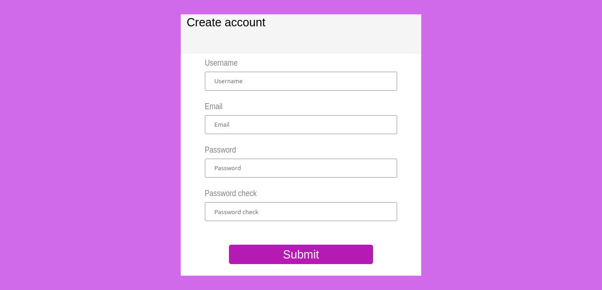

# Form validaton

This is a solution to the [Form validaton](Form-validation) project. this challenge help me improve my coding skills by building realistic projects. 

## Table of contents

- [Form validaton](#form-validaton)
  - [Table of contents](#table-of-contents)
  - [Overview](#overview)
    - [The challenge](#the-challenge)
    - [Screenshot](#screenshot)
    - [Links](#links)
  - [My process](#my-process)
    - [Built with](#built-with)
    - [What I learned](#what-i-learned)
    - [Continued development](#continued-development)
  - [Author](#author)

## Overview

The goal of this project is to practice what i learned about JavaScript DOM and Functions, the project is a Form build in HTML, CSS and JavaScript..

### The challenge

Users should be able to:

- Enter there info in form feilds.
- Get Error message explaination if they enter incorrect info.
- View validation message after submiting.

### Screenshot

### Links

- Live Site URL: [https://tariqelb.github.io/Form-validation/](https://tariqelb.github.io/Form-validation/)

## My process

### Built with

- Semantic HTML5 markup
- Semantic HTML5 markup
- CSS custom properties
- Flexbox
- Document Object Module (DOM), Event listner
- JavaScript

### What I learned

In this challenge i learn how to use DOM, event and function to validate a form data.

### Continued development

On the next projrct i will focus on how to send form data in a secure way to the server and retrieve it.

## Author

- Facebook - [Tariq El bouhali](https://www.facebook.com/tariqelbouhali)